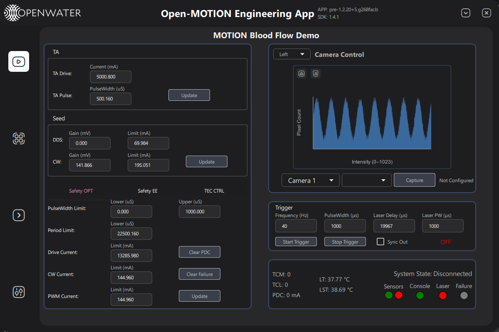

# Open-Motion Test Application

Python example UI for OPEN Motion used for Hardware Testing and Basic Usage



## Installation

### Prerequisites
- **Python 3.9 or later**: Make sure you have Python 3.9 or later installed on your system. You can download it from the [official Python website](https://www.python.org/downloads/).

### Steps to Set Up the Project
1. **Install OpenLIFU Python**
   ```bash
   https://github.com/OpenwaterHealth/openmotion-sdk
   cd openmotion-sdk
   pip install -r requirements.txt
   ```

2. **Clone the repository and Install Required Packages**:
   ```bash
   git clone https://github.com/OpenwaterHealth/openmotion-test-app.git
   cd openmotion-test-app
   pip install -r requirements.txt
   ```

3. **Install libusb for your system**
   requires libusb to be installed, for windows install the dll to c:\windows\system32, download the correct dll from github

   ```
   https://github.com/libusb/libusb/releases
   ```

3. **Run application**
   requires openmotion-sdk to be installed or referenced prior to running main.py

   ```bash
   cd openmotion-test-app
   python main.py
   ```


## Run packager
```
python -m PyInstaller -y openwater.spec
```

## SBOM

This repository includes a CycloneDX SBOM at `sbom.cyclonedx.json`.

Regenerate it after dependency or packaging changes:

```bash
python scripts/generate_sbom.py
```

The SBOM is derived from the repository's declared Python dependencies and packaging evidence in `requirements.txt`, `openwater.spec`, `README.md`, and `.github/workflows/release-build.yml`.