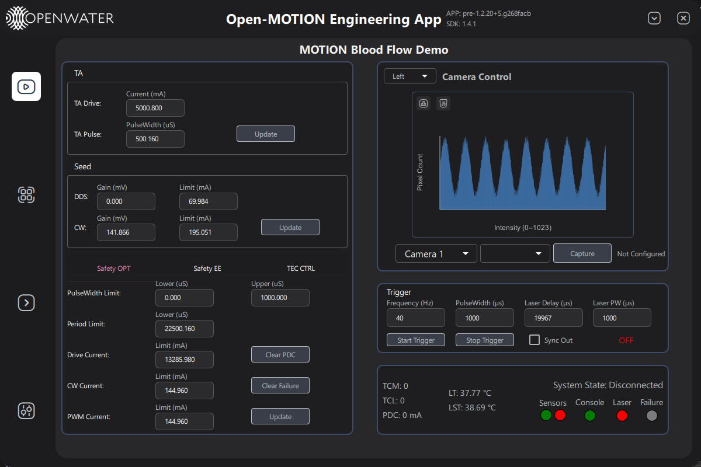

# Open-Motion Test Application

Python example UI for OPEN Motion used for Hardware Testing and Basic Usage



## Installation

### Prerequisites
- **Python 3.12 or later**: Make sure you have Python 3.12 or later installed on your system (the Open-Motion SDK requires 3.12+). You can download it from the [official Python website](https://www.python.org/downloads/).

### Steps to Set Up the Project
1. **Install the Open-Motion SDK (`omotion` Python library)**
   ```bash
   git clone https://github.com/OpenwaterHealth/openmotion-sdk.git
   cd openmotion-sdk
   pip install .
   ```

2. **Clone the repository and Install Required Packages**:
   ```bash
   git clone https://github.com/OpenwaterHealth/openmotion-test-app.git
   cd openmotion-test-app
   pip install -r requirements.txt
   ```

3. **Install libusb for your system**
   requires libusb to be installed, for windows install the dll to c:\windows\system32, download the correct dll from github

   ```
   https://github.com/libusb/libusb/releases
   ```

4. **Run application**
   requires the Open-Motion SDK (`omotion`) to be installed or referenced prior to running main.py

   ```bash
   python main.py
   ```


## Offline / factory use

The app queries GitHub for firmware releases at startup. On a machine with no
internet, launch with:

```
python main.py --no-github
```

This skips every release query. The firmware dropdowns then offer only
`Upload File...`, and all three flashing paths work from a file on disk:

| What | File to select |
|---|---|
| Console / sensor application firmware | `motion-console-fw-*.bin` / `motion-sensor-fw-*.bin` |
| Bootloader (converts a bare-metal device) | `motion-console-production.bin` / `motion-sensor-production.bin` |
| FPGA (TA, Seed, Safety EE, Safety OPT) | the target's `.jed` |

Installing the bootloader is **irreversible over USB** — afterwards the device
only accepts signed firmware, and returning it to a normal image needs an
ST-LINK/SWD debugger. The app confirms before doing it, refuses an image built
for the other device, and the SDK aborts without writing if the device already
has a bootloader.

## Run packager
```
python -m PyInstaller -y openwater.spec
```

## SBOM

This repository includes a CycloneDX SBOM at `sbom.cyclonedx.json`.

Regenerate it after dependency or packaging changes:

```bash
python scripts/generate_sbom.py
```

The SBOM is derived from the repository's declared Python dependencies and packaging evidence in `requirements.txt`, `openwater.spec`, `README.md`, and `.github/workflows/release-build.yml`.